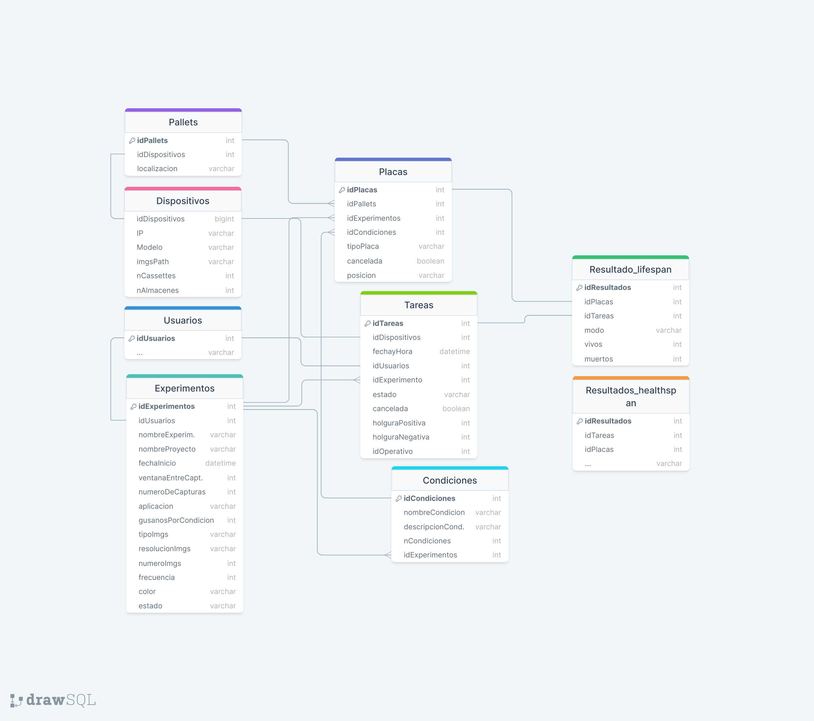

# Interfaz para automatizar ensayos con _C.elegans_

<div align="justify"> Interfaz diseñada para controlar los sistemas Multiview y Tower para la automatización completa de ensayos con C.elegans. Esta interfaz consiste en un frontend realizado en React y un backend realizado en Django.

## Esquema General

Mediante la interacción con el frontend el usuario puede definir y controlar nuevos ensayos y visualizar los resultados una vez han finalizado.

El backend se comunica directamente con la base de datos MySQL.

La interacción interfaz - sistemas será indirecta a través de esta base de datos.

<p align="center">
    
</p>

## Base de Datos

La base de datos MySQL cuenta con la siguiente estructura.

<p align="center">
    
</p>

Las tablas Dispositivos y Pallets hacen referencia a los propios sistemas disponibles.

Habrá una tabla de Resultados para cada tipo de ensayo, debido a que la información que se extrae de cada uno es necesariamente diferente.

Las tablas Experimentos, Condiciones, Placas y Tareas estructuran los propios experimentos, y será en esta tabla Tareas en la que, al crear un nuevo ensayo, se definen los puntos de captura que tendrán que ejecutar los sistemas.

## Gestión de Estados

Las tareas son las que permiten la organización de los sistemas, y el campo estado el que permite conocer el punto en el que se encuentra cada una de las tareas.

Cada tarea pasa por los siguientes estados.

<p align="center">
    
</p>

Al crear un nuevo ensayo se definen todas las tareas con estado pendiente. A partir de este punto, la gestión del estado de las tareas es llevada por los propios sistemas.

## Acciones del Usuario

El usuario tiene tres formas de interactuar con la aplicación, creando un ensayo nuevo, controlando los ensayos en transcurso y visualizando resultados de los ensayos finalizados.

En todas ellas el usuario tiene cierto grado de control sobre los parámetros del experimento, como placas, pallets o condiciones.

En el siguiente diagrama se puede ver la lógica de cada una de estas gestiones.

<p align="center">
    
</p>
 </div>

## Comunicación Frontend - Backend

La comunicación entre el frontend y el backend se realiza a través de los siguientes endpoints de la API, teniendo cada uno con los métodos que se listan.

### Nuevo Ensayo

```py
'new/'
```

#### GET

```js
{
    capturas: [
        (
            nombreExperimentos: ,
            fechayHora: ,
        ),
        (
            nombreExperimentos: ,
            fechayHora: ,
        ),
        ...
    ]
}
```

#### POST

```js
{
    idUsuarios: ,
    nombreExperimentos: ,
    fechaInicio: ,
    ventanaEntreCapturas: ,
    numeroDeCapturas: ,
    aplicacion: ,
    nombreProyecto: ,
    nCondiciones: ,
    condiciones: {
        nombreCondiciones: [
            [idPallet, tipoPlaca],
            [idPallet, tipoPlaca],
            [idPallet, tipoPlaca],
            ...
        ],
        nombreCondiciones: [
            ...
        ]
    }
}
```

### Panel de Control

```py
'control/'
```

Información de todos los ensayos que aún están en transcurso.

#### GET

```js
{
    experimentos: [
        {
            id: ,
            nombre: ,
            aplicacion: ,
            proyecto: ,
            porcentaje: ,
        },
        ...
    ]
}
```

```py
'control/<int:pk>'
```

Toda la información de un solo ensayo.

#### GET

```js
{
    nombre: ,
    proyecto: ,
    aplicacion: ,
    nplacas: ,
    ncapturas: ,
    condiciones: [
        nombreCondicion,
        nombreCondicion,
        ...
    ],
    placas: [
        idPlacas,
        idPlacas,
        ...
    ],
    capturas: [
        {
            title: ,
            start: ,
            allday: false,
        },
        ...
    ],
}
```

#### PUT

```js
{
    table: ,
    id: ,
}
```

#### DELETE

### Resultados

```py
'results/'
```

Información de todos los ensayos acabados.

#### GET

```js
{
    experimentos: [
        {
            id: ,
            nombre: ,
            aplicacion: ,
            proyecto: ,
        },
        ...
    ]
}
```

```py
'results/<int:pk>'
```

Toda la información de un ensayo acabado.

#### GET

```js
{
    condiciones: {
        idCondiciones: [
            idPlacas,
            idPlacas,
            ...
        ],
        idCondiciones: [
            idPlacas,
            idPlacas,
            ...
        ],
        ...
    },
    placas: {
        idPlacas: [
            vivos, //dia 1
            vivos, //dia 2
            ...
        ],
        idPlacas: [
            vivos, //dia 1
            vivos, //dia 2
            ...
        ],
        ...
    },
}
```
