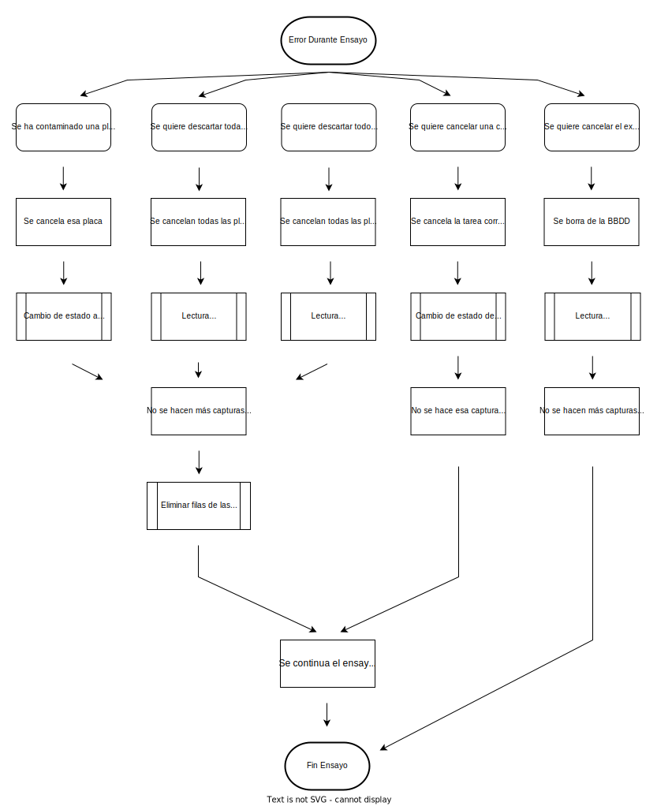

# Planificador

Interfaz diseñada para gestionar los ensayos realizados en los dispositivos Multiview y The Tower.

## Esquema General

Cada equipo cuenta con una base de datos MySQL, un backend desarrollado en Django y dos frontends desarrollados en React, el planificador y la interfaz de dispositivo.

<p align="center">
    
</p>

## Base de Datos

La base de datos MySQL cuenta con la siguiente estructura.

<p align="center">
    
</p>

Las tablas Dispositivos y Pallets hacen referencia a los propios sistemas disponibles.

Habrá una tabla de Resultados para cada tipo de ensayo, debido a que la información que se extrae de cada uno es necesariamente diferente.

Las tablas Experimentos, Condiciones, Placas y Tareas estructuran los propios experimentos, y será en esta tabla Tareas en la que, al crear un nuevo ensayo, se definen los puntos de captura que tendrán que ejecutar los sistemas.

## Gestión de Estados

Las tareas son las que permiten la organización de los sistemas, y el campo estado el que permite conocer el punto en el que se encuentra cada una de las tareas.

Cada tarea pasa por los siguientes estados.

<p align="center">
    
</p>

Al crear un nuevo ensayo se definen todas las tareas con estado pendiente. Este estado pasará a lanzada cundo comience la ejecución de la captura o a cancelada mediante el input del usuario. Una vez se han procesado todas las imágenes de este punto de captura su estado pasa a borrada.

También existe una gestión de los errores durante el transcurso de los ensayos. Esto permite cancelar durante el ensayo una de sus placas, una condición completa, una de las capturas de imagen o el propio ensayo.

<p align="center">
    
</p>

## Comunicación Frontend - Backend

La comunicación entre el frontend y el backend se realiza a través de los siguientes endpoints de la API, teniendo cada uno con los métodos que se listan.

### Nuevo Ensayo

```py
'new/'
```

GET

```js
{
    capturas: [
        (
            fechayHora: ,
            nombreExperimentos: ,
        ),
        ...
    ],
    almacenes: [ 
        [1,1,1,1,0,0,0,0,0], 
        [0,0,0,0,0,0,0,0,0]
    ] //1 = ocupado, 0 = libre
}
```

POST

```js
{
    datos: {
    nombreExperimento: ,
    nombreProyecto: ,
    aplicacion: ,
    color: ,
    userId: ,
    gusanosPorCondicion: ,
    },
    condiciones: {
    nCondiciones: ,
    condiciones: ,
    placas: ,
    tipoPlaca: , //filas x columnas
    },
    captura: {
    fechaInicio: ,
    ventanaEntreCapturas: ,
    numeroDeCapturas: ,
    pallets: ,
    placasPorCondicion: ,
    tareas: ,
    },
    parametros: {
    tipoImg: ,
    resolucion: ,
    frecuencia: ,
    nImgs: ,
    },
    changes: , //tareas a modificar
}
```

### Panel de Control

```py
'control/'
```

Información de todos los ensayos que aún están en transcurso.

GET

```js
{
    experimentos: [
        {
            id: ,
            nombre: ,
            aplicacion: ,
            proyecto: ,
            porcentaje: ,
        },
        ...
    ]
}
```

```py
'control/<int:pk>'
```

Toda la información de un solo ensayo.

GET

```js
{
    nombre: ,
    proyecto: ,
    aplicacion: ,
    nplacas: ,
    ncapturas: ,
    condiciones: [
        nombreCondicion,
        nombreCondicion,
        ...
    ],
    placas: [
        idPlacas,
        idPlacas,
        ...
    ],
    capturas: [
        {
            title: ,
            start: ,
            allday: false,
        },
        ...
    ],
    color: ,
    resultados: {
        cond: {
            idPlacas: [], //idPlaca: [resultado1, resultado2, ...]
            idPlacas: [],
            ...
        },
        ...
    },
    show: , //bool que indica si mostrar resultados
}
```

PUT

```js
{
    table: ,
    id: ,
}
```

### Resultados

```py
'results/'
```

Información de todos los ensayos acabados.

GET

```js
{
    experimentos: [
        {
            id: ,
            nombre: ,
            aplicacion: ,
            proyecto: ,
        },
        ...
    ]
}
```

```py
'results/<int:pk>'
```

Toda la información de un ensayo acabado.

GET

```js
{
    ensayo: ,
    proyecto: ,
    aplicacion: ,
    nCapturas: ,
    inicio: ,
    condiciones: [
        (nombreCondicion, idCondicion),
        ...
    ],
    placas: ,
    resultados: {
        idCondiciones: {
            idPlacas: [], //idPlaca: [resultado1, resultado2, ...]
            idPlacas: [], //idPlaca: [resultado1, resultado2, ...]
            ...
        },
        ...
    },
}
```
