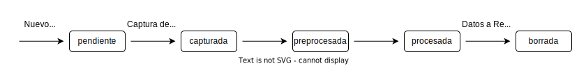

# Interfaz para automatizar ensayos con _C.elegans_

 Interfaz diseñada para controlar los sistemas Multiview y Tower para la automatización completa de ensayos con C.elegans. Esta interfaz está estructurada en un frontend realizado en React y un backend realizado en Django.

## Esquema General

Mediante la interacción con el frontend el usuario puede definir y controlar nuevos ensayos y visualizar los resultados una vez acaban.

El backend se comunica directamente con la base de datos MySQL de los sistemas.

La interacción interfaz - sistemas será a través de esta base de datos.

## Base de Datos

La base de datos MySQL cuenta con la siguiente estructura.

Cuenta con tablas Dispositivos y Pallets, que hacen referencia a los propios sistemas disponibles. Habrá una tabla de Resultados para cada tipo de ensayo, debido a que la información que se extrae de cada uno es necesariamente diferente.

Las tablas Experimentos, Condiciones, Placas y Tareas estructuran los propios experimentos, y será en esta tabla Tareas en la que, al crear un nuevo ensayo, se definen los puntos de captura que tendrán que ejecutar los sistemas.

## Gestión de Estados

La tabla Tareas es la que define las acciones de los sistemas, y el campo estado el que permite conocer el punto en el que se encuentra cada una de las tareas.

Cada tarea pasa por los siguientes estados.

Al crear un nuevo ensayo se definen todas las tareas con estado pendiente. A partir de este punto, la gestión del estado de las tareas es llevado por los propios sistemas.

## Acciones del Usuario

El usuario tiene tres formas de interactuar con la aplicación, creando un ensayo nuevo, controlando los ensayos y visualizando resultados.

En todas ellas el usuario tiene cierto grado de control sobre los parámetros del experimento, como placas, pallets, condiciones o el propio experimento.

En el siguiente diagrama se puede ver la lógica de cada una de estas gestiones.

    

 

